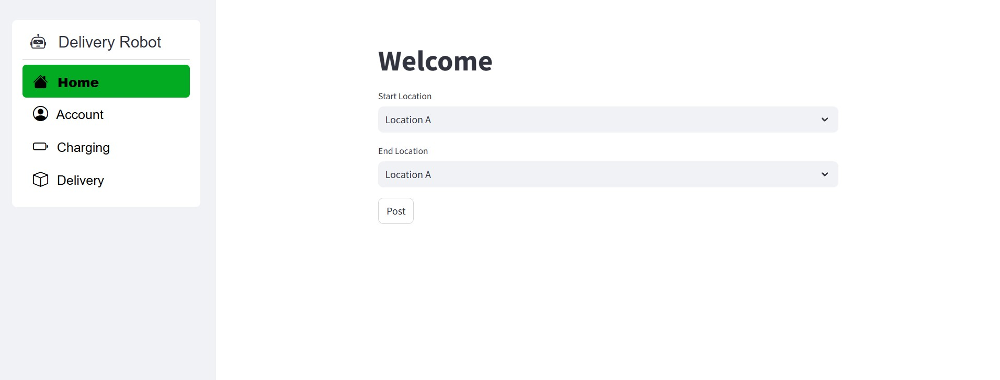
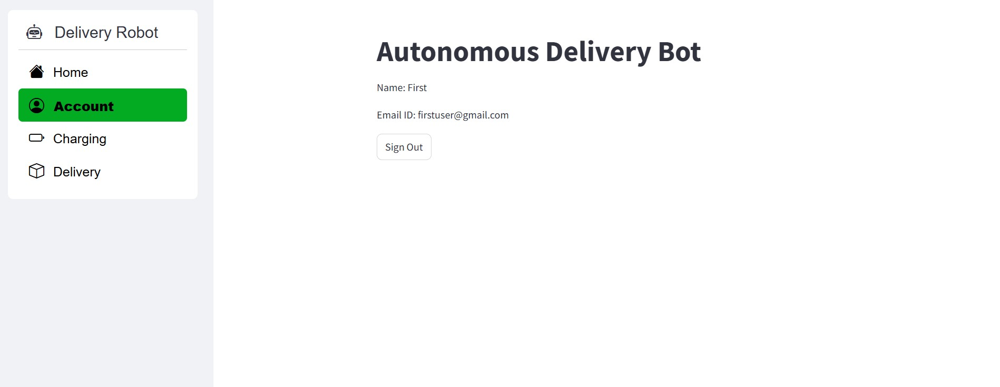
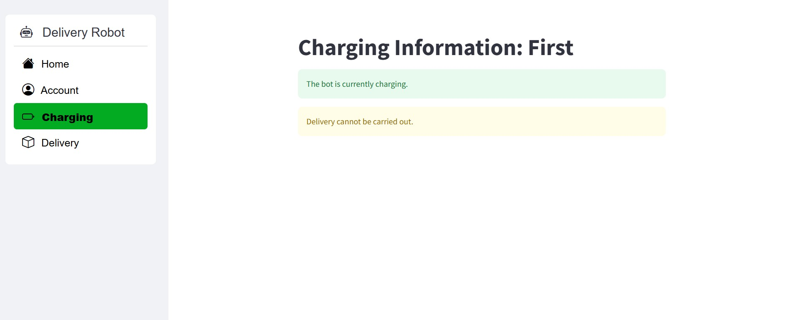
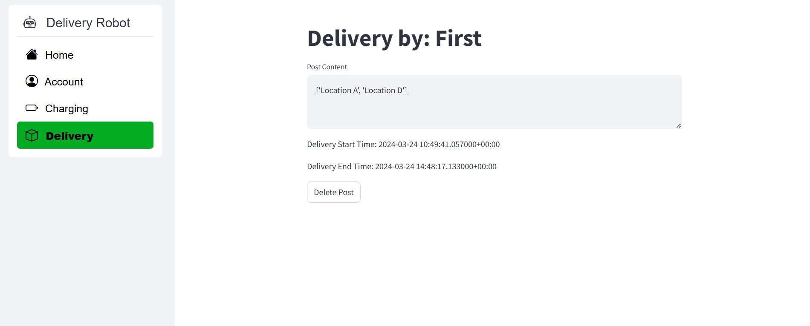

# Autonomous Delivery Bot

This is a Streamlit-based multi-page web application for managing an autonomous delivery bot system. It uses Firebase for user authentication and data storage. The application includes multiple pages for Home, Charging, Delivery, and Account management.

---

## Features
- **Login and Signup:** User authentication via Firebase.
- **Charging Information:** Check the charging status of the bot.
- **Delivery Management:** Manage delivery start and end points.
- **Post Management:** Create, view, and delete delivery posts.

---

## Prerequisites

Before running this application, ensure you have the following installed:
1. **Python 3.8 or higher**
2. **Firebase Project** with the following:
   - Firestore database enabled.
   - Service account key file (`firebase_service_account_key_file.json`).
   - Firebase Authentication enabled.

---

## Installation Guide

### Step 1: Clone the Repository
```bash
git clone https://github.com/yourusername/autonomous-delivery-bot.git
cd autonomous-delivery-bot
```


### Step 2: Install Dependencies
Install the required Python libraries:


```bash
pip install streamlit
pip install streamlit-option-menu
pip install firebase-admin
```

### Step 3: Configure Firebase
1. **Add the Firebase Service Account Key File:**
   Place the `firebase_service_account_key_file.json` file in the root directory of the project. Ensure this file contains the service account credentials for your Firebase project.

2. **Set Firebase Project Credentials:**
   Update the Firebase configuration file (`firebase_config.json`) with your Firebase project's settings. Include the API key, Auth Domain, and Project ID.

### Step 5: Run the Application

Once the dependencies are installed and Firebase is configured, start the Streamlit application using the command below:

```bash
streamlit run app.py
```

---

## Application Pages Overview

### 1. **Home Page**


The Home Page allows users to specify the pickup and drop locations for a delivery. This simple interface ensures ease of use for setting up new deliveries.

- **Key Elements:**
  - **Start Location:** Input field to specify the pickup point.
  - **End Location:** Input field to specify the delivery destination.

---

### 2. **Account Page**


This page displays the user account details, including the name and email ID of the registered user. The "Sign Out" button allows the user to log out of the dashboard securely.

- **Key Elements:**
  - User name and email information.
  - Sign-out button for session management.

---

### 3. **Charging Page**


This page provides information about the robot's current charging status. It displays a message when the robot is charging and indicates that deliveries cannot be performed while charging.

- **Key Elements:**
  - Charging status display: "The bot is currently charging."
  - Delivery restriction message: "Delivery cannot be carried out."

---

### 4. **Delivery Page**


This page is used to track and manage deliveries. It shows delivery details, including start and end times, the delivery route, and an option to delete a delivery record.

- **Key Elements:**
  - Delivery locations displayed as a list.
  - Delivery start and end timestamps.
  - "Delete Post" button for removing a delivery entry.

